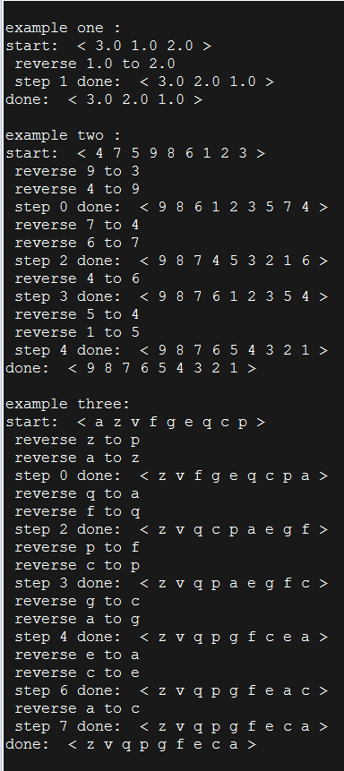

#用scala实现的类型通用的烙饼排序算法。

##烙饼排序问题描述：
把一摞大小不一的烙饼按顺序排好，大的在下面，小的在上面，要求只能用一只手去翻转烙饼位置，另一只手要端盘子，要求输出最优化的排序过程。

##示例：
3 1 2

翻转 1 , 当前烙饼排序 3 2 1

完成

##解题思想：

每次都先找出未排序烙饼中最大的烙饼，然后将其翻转到最上面。然后将它翻转到已排序烙饼的最上层，接着换下一块，如此就可完成排序。

##截图

